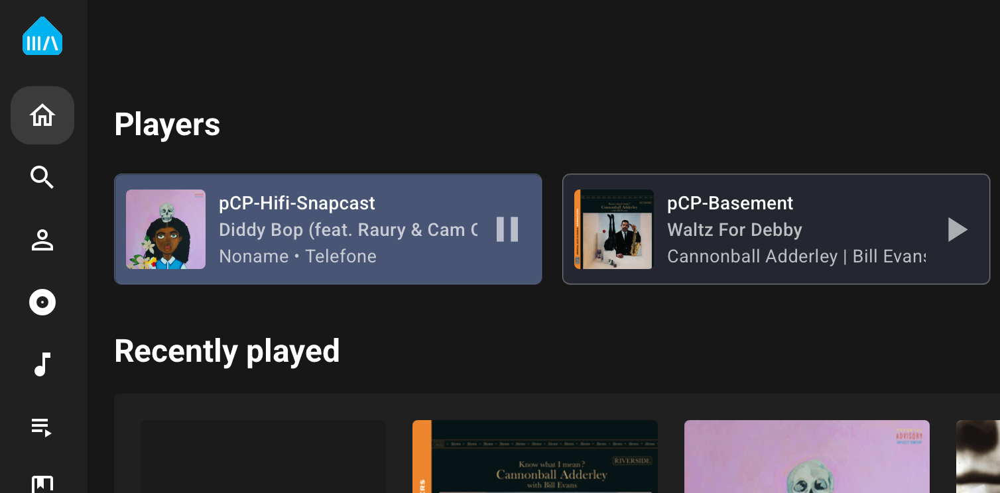
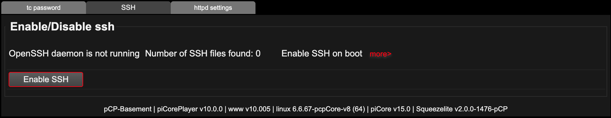
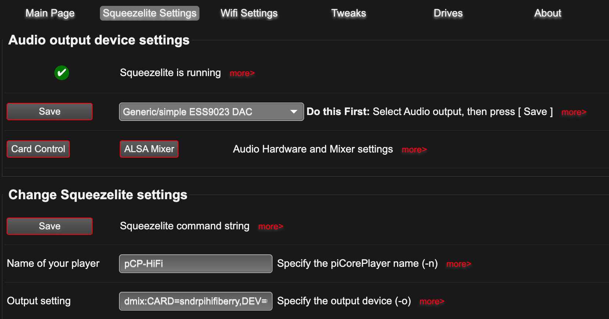
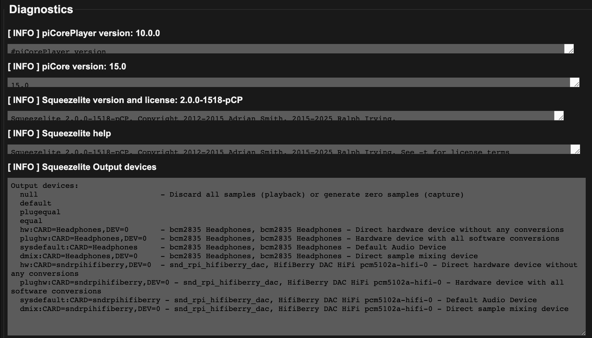
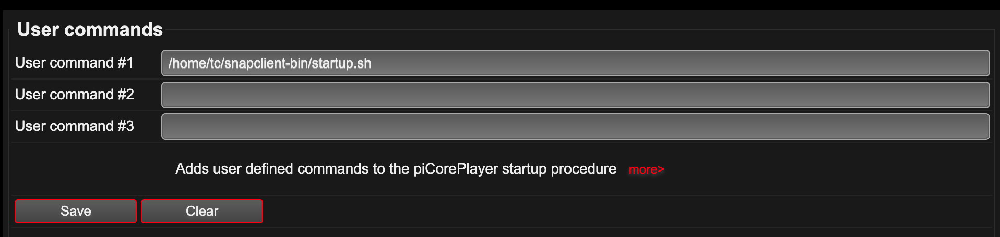

# Snapclient Installer for PiCorePlayer

Automated installer for [Snapcast Client](https://github.com/badaix/snapcast) on **[PiCorePlayer 10.x](https://www.picoreplayer.org)** (TinyCore Linux 15.x).



## What This Does

[PiCorePlayer](https://www.picoreplayer.org) is an easy way to turn a Raspberry Pi into a streaming music player for use with Home Assistant/Music Assistant or other media servers. It includes Squeezelite (LMS) and AirPlay support by default. This installer adds **Snapcast**, a low-latency multi-room audio solution that allows synchronized playback across multiple devices. 

[Snapcast](https://github.com/badaix/snapcast) is particularly well-suited for [Music Assistant](https://www.music-assistant.io/faq/stream-to/) users who want to stream to Raspberry Pis, Linux servers, [high quality embedded streaming devices](https://sonocotta.com/esparagus-hifi-medialink/) or DIY [ESP32-based clients](https://github.com/pschatzmann/arduino-snapclient).

The script installs the Snapcast client binary, manages TinyCore dependencies, and configures ALSA to allow Squeezelite and Snapclient to play audio simultaneously without device conflicts.

## Prerequisites

1.  **PiCorePlayer Installed:** Follow the official [Getting Started Guide](https://docs.picoreplayer.org/getting-started/) to flash and boot your device.
2.  **Password Set:** Modern PiCorePlayer versions do **not** have a default password. You must set a password for the `tc` user during setup or via the web interface.
3.  **Network Connected:** to download dependencies.
4.  **SSH access works:** enable SSH in the pCP web interface (Main Page > Security > SSH tab) and log in.


*(enable from the SSH tab of the security settings page)*

## Understanding Audio on PiCorePlayer

PiCorePlayer is designed for audiophile bit-perfect playback. To understand what this script does, it helps to know two ALSA (Linux Audio) terms:

*   **`hw` (Hardware):** This gives an application **exclusive** control over the sound card. If Squeezelite grabs the card via `hw`, no other app (like Snapclient) can make a sound. pCP defaults to this for maximum purity.
*   **`dmix` (Direct Mixing):** This is a software mixer. It allows multiple applications to play audio simultaneously by mixing the streams before sending them to the hardware.

**The Solution:** This script configures your system to use `dmix`. This allows your Pi to act as a Squeezelite endpoint AND a Snapcast client at the same time, without "Device Busy" errors.

## System Changes Made

This script runs entirely as the standard `tc` user (using `sudo` only where necessary) and makes the following changes to your system:

*   **Extensions:** Downloads and installs required TinyCore libraries: `avahi`, `flac`, `libvorbis`, `opus`, `expat2`, `pcp-libsoxr`, and `gcc_libs`.
*   **Binary:** Installs the Snapclient binary (Debian Bookworm build) to `/home/tc/snapclient-bin/`.
*   **ALSA Config:** Creates `/home/tc/.asoundrc` to handle volume attenuation and mixing.
*   **Persistence:** updates `/opt/.filetool.lst` to ensure the binary and config files survive a reboot.
*   **Startup:** Generates a wrapper script `/home/tc/snapclient-bin/startup.sh` to handle boot-up execution.

## Installation

1.  SSH into your PiCorePlayer:

```bash
ssh tc@<YOUR_PI_IP>
```

2.  Download the installer:

```bash
wget -O pcp_install_snapcast.sh https://raw.githubusercontent.com/somebox/piCorePlayer-snapcast/main/pcp_install_snapcast.sh
```

3.  Make it executable and run it:

```bash
chmod +x pcp_install_snapcast.sh
./pcp_install_snapcast.sh
```

## Configuration Guide

### 1. Script Interaction
The script will ask you for:
*   **Snapserver IP:** The address of your Music Assistant or Snapserver instance.
*   **Audio Device:** A list will appear. Select the number corresponding to the device labeled `dmix`.
*   **Attenuation:** Select a volume level (Recommended: **30%**).
    *   *Note:* Most DAC HATs lack hardware volume control. Without digital attenuation, mixing two streams will cause severe distortion.

### 2. Squeezelite Settings (Web Interface)
Configure Squeezelite to share the audio device:

1.  Go to the **Squeezelite Settings** tab.
2.  Look for **Audio output device settings**.
3.  Click **Change** and select the device prefixed with `dmix` (e.g., `dmix:CARD=sndrpihifiberry...`).
4.  Set **ALSA Volume Control** to `None` (or clear the field).
5.  Click **Save** and **Restart Squeezelite**.


*(Ensure the Output Setting is set to a dmix device)*

Note: you can list your available devices with `pcp -l` from the ssh session, or by browsing to the diagnostics page in the web interface:


*(List of available devices)*

### 3. Enable Snapclient (Web Interface)

To make Snapclient start automatically on boot:

1.  Go to the **Tweaks** tab.
2.  Scroll down to **User Commands**.
3.  In the "User Command #1" slot, paste the line provided by the installer script output:

```bash
/home/tc/snapclient-bin/startup.sh
```
4.  Click **Save**.


*(Add the user command to the User Commands slot)*

### 4. Reboot
Reboot your device via the web interface, or from the command line with `pcp rb`. Upon restart, both services should be active.

## Troubleshooting

*   **Distorted Audio:** Re-run the installer and choose a stronger attenuation level (e.g., Option 1 - 30%).
*   **No Audio / Connection Refused:** Check the logs to see if Snapclient is connecting to the correct IP:

```bash
tail -f /tmp/snapclient.log
```

*   **"Device Busy" Error:** This means one of the services (Squeezelite or Snapclient) is still trying to use `hw:` (exclusive mode). Ensure both are configured to use the `dmix` device.
*   **Shairport doesn't start or is silent:** There's a config page where the audio output device is set. Try setting it to a dmix device.

## How It Works

The installer performs these operations:

1. **Architecture Detection:** Identifies the CPU architecture (armhf or arm64) to download the correct Snapcast binary.
2. **Dependency Resolution:** Installs required TinyCore extensions (FLAC, Vorbis, Opus, SoXR, Avahi) from the pCP repository or upstream TinyCore repos.
3. **Binary Extraction:** Downloads the official Debian package from the [Snapcast releases](https://github.com/badaix/snapcast/releases) and extracts the client binary.
4. **Audio Configuration:** Creates an ALSA configuration file (`~/.asoundrc`) that applies digital volume attenuation to prevent clipping when mixing multiple audio streams.
5. **Persistence:** Adds the binary and configuration to pCP's backup list so they survive reboots.
6. **Startup Script:** Generates a wrapper script for boot-time execution via pCP's User Commands feature.

## References

This project was developed using the following documentation:

### Snapcast

- [Snapcast Official Repository](https://github.com/badaix/snapcast/releases)
- [Music Assistant Stream-to FAQ](https://www.music-assistant.io/faq/stream-to/)
- [ESP32 Snapclient](https://github.com/CarlosDerSeher/snapclient)
- [Arduino and ESP32 Snapclient](https://github.com/pschatzmann/arduino-snapclient)

### PiCorePlayer

- [PiCorePlayer Official Website](https://www.picoreplayer.org)
- [Getting Started Guide](https://docs.picoreplayer.org/getting-started/)
- [Backup & Restore](https://docs.picoreplayer.org/information/pcp_backup/)
- [DIY Extensions / Boot Scripts](https://docs.picoreplayer.org/information/picore_extensions/)
- [Editing config.txt](https://docs.picoreplayer.org/how-to/edit_config_txt/)
- [Extension Repository (15.x aarch64)](https://repo.picoreplayer.org/repo/15.x/aarch64/tcz/)

### TinyCore Linux

- [TinyCore Introduction](http://www.tinycorelinux.net/intro.html)
- [Upstream Repositories (15.x)](http://tinycorelinux.net/15.x/)

### Audio

- [Squeezelite Main Page](https://ralph-irving.github.io/squeezelite.html)

## Credits

This installer was developed from scratch for PiCorePlayer 10.x, with reference to prior work by:

- [bjwelker's Snapcast-piCore](https://github.com/bjwelker/Snapcast-piCore)
- [m-kloeckner's snapcast-tcz](https://github.com/m-kloeckner/snapcast-tcz)

## Roadmap and Contributions

This project is being used to test a complex home audio setup with many open source devices. It might make sense to turn it into an integrated pCP extension in the future. If anyone is interested in helping with this, please let me know.

There's more work to do on volume control and mixing, and Music Assistant has stability issues with Shairport Sync.

Pull requests are welcome. For significant changes, please open an issue first to discuss the proposed changes.

## License

This project is provided as-is for community use.